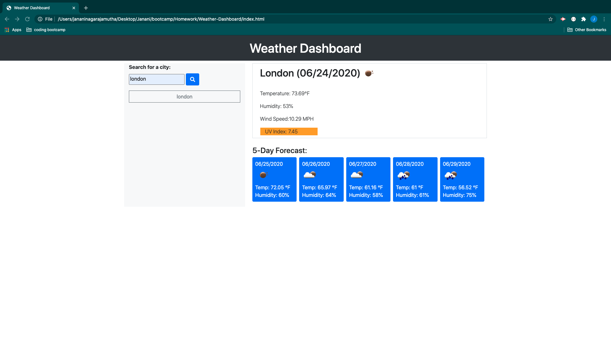

# Weather-Dashboard

## Description 

This repository consists of code that creates a weather dashboard.

The project uses an HTML page for user interface, bootstrap for styling the HTML. The application uses jQuery to implement the logic. "moment.js" is used for manupulating date and time values. Local storage is used for data persistance. AJAX calls is made to connect to third-party API

When the user enters a city name and press enter, the current weather for the city and 5-day forecast for the city is displayed. GThe city is added to search list.

When the user loads the page, his last seen city's weather details are displayed with a list of cities from the search history.

Git is used for version controlling and for periodic commits to Gitlab.

## Deployed Application URL
https://janani2285.github.io/Weather-Dashboard/

## Screenshots of the application

